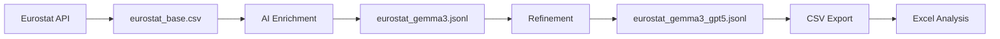

# 📊 Data Directory

This directory contains the core datasets and metadata for the Open Government Data Explorer project.

## 📁 Files Overview

| File | Description | Size | Records | Format |
|------|-------------|------|---------|--------|
| `eurostat_base.csv` | Original Eurostat dataset catalog | 2.2MB | 7,857 | CSV |
| `eurostat_gemma3.jsonl` | AI-enriched metadata (basic) | 1.0MB | 703 | JSONL |
| `eurostat_gemma3_gpt5.jsonl` | AI-enriched metadata (refined) | 835KB | 590 | JSONL |
| `test.csv` | Sample dataset for testing | 4.9KB | - | CSV |
| `test_single.csv` | Single record test file | 844B | - | CSV |

---

## 🔍 Data Structure Examples

### `eurostat_base.csv` - Original Dataset Catalog

**Structure:** Raw Eurostat metadata with basic information about each dataset.

**Example Record:**
```csv
Unnamed: 0,title,code,type,lastupdateofdata,lasttablestructurechange,datastart,dataend,label,source,updated,dimensions
0,"Populationbysex,age,countryofbirth,labourstatusanddegreeofurbanisation",LFST_R_PGAUWSC,dataset,2024-09-12T23:00:00+0200,2024-04-24T23:00:00+0200,1995,2023,,,,
```

**Key Fields:**
- `code`: Unique dataset identifier (e.g., `LFST_R_PGAUWSC`)
- `title`: Dataset name
- `datastart`/`dataend`: Time coverage
- `lastupdateofdata`: When data was last refreshed

---

### `eurostat_gemma3.jsonl` - AI-Enriched Metadata

**Structure:** Each line contains a JSON object with AI-generated descriptions, queries, and applications.

**Example Record:**
```json
{
  "code": "TOUR_OCC_NINRAW",
  "title": "Nightsspentattouristaccommodationestablishments bycountryoforiginofthetourist",
  "years": {"start": 1990, "end": 2023},
  "source": "ESTAT",
  "last_update": "2025-10-11T11:00:00+0200",
  "dimensions": ["freq", "unit", "nace_r2", "c_resid", "geo", "time"],
  "enriched_description": "This dataset tracks the number of nights tourists spend in accommodation establishments, broken down by country of origin (geo), economic activity (nace_r2), and time period (time). Data is aggregated by residence country and accommodation type.",
  "example_queries": [
    "How has the number of nights spent in tourist accommodation establishments changed over time from 1990 to 2023?",
    "Which countries show the highest number of nights spent at tourist accommodation establishments?",
    "What are the differences in the number of nights spent in tourist accommodation establishments between different economic activity sectors?"
  ],
  "potential_applications": [
    "Tourism market analysis",
    "Economic forecasting", 
    "Destination management planning"
  ],
  "join_keys": ["geo", "time", "nace_r2"],
  "notes": "Data represents aggregated counts of tourist accommodation stays. The dataset includes dimensions for frequency, unit, NACE Rev. 2, residual classification, geographic location, and time.",
  "confidence": {"desc": 0.95, "queries": 0.9, "apps": 0.85}
}
```

**AI-Enhanced Fields:**
- `enriched_description`: Human-readable explanation of the dataset
- `example_queries`: Suggested analysis questions
- `potential_applications`: Real-world use cases
- `join_keys`: Fields for linking with other datasets
- `confidence`: AI confidence scores for each enhancement

---

## 🤖 AI Enrichment Process

The metadata has been enhanced using **Ollama + Gemma3** to provide:

1. **📝 Clear Descriptions**: Transform technical titles into readable explanations
2. **❓ Example Queries**: Generate meaningful analysis questions
3. **🎯 Applications**: Identify real-world use cases
4. **🔗 Join Keys**: Suggest fields for data linking
5. **📊 Confidence Scores**: Rate the quality of AI enhancements

## 🔄 Data Pipeline



## 📈 Usage Examples

### Load Original Catalog
```python
import pandas as pd
df = pd.read_csv('data/eurostat_base.csv')
print(f"Total datasets: {len(df)}")
```

### Process AI-Enhanced Metadata
```python
import json
with open('data/eurostat_gemma3.jsonl', 'r') as f:
    datasets = [json.loads(line) for line in f]
    
# Find tourism datasets
tourism = [d for d in datasets if 'tour' in d['code'].lower()]
```

### Convert to Excel
```bash
python utils/jsonl_to_csv.py data/eurostat_gemma3_gpt5.jsonl -o analysis.csv
```

---

## 🏷️ Dataset Categories

The enriched metadata covers diverse domains:

- **👥 Demographics**: Population, migration, urbanization
- **💼 Labor**: Employment, wages, working conditions  
- **🏥 Health**: Medical access, occupational health
- **🎓 Education**: Enrollment, training, skill development
- **🏨 Tourism**: Accommodation, visitor statistics
- **💰 Economics**: Trade, productivity, consumption
- **🏭 Industry**: NACE classifications, sectoral analysis

## 📊 Quality Metrics

- **Coverage**: 590 datasets with full AI enrichment
- **Confidence**: Average scores 0.85+ across all dimensions
- **Completeness**: All records include descriptions, queries, and applications
- **Consistency**: Standardized JSON schema across all entries

---

*Generated by Open Government Data Explorer - Making statistical data accessible and actionable* 🚀
